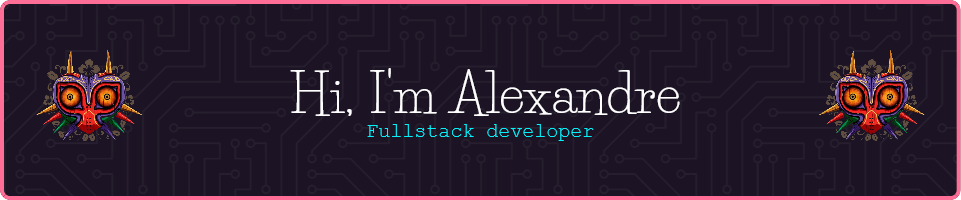

<h3 align="center">I'm a passionate developer from France 🇫🇷 , living in Spain 🇪🇸 </h3>
   

- 🔭 I’m currently working on cool projects on **React** & **Angular** for Wild code school & friends

- 🌱 I’m currently learning **Angular, Typescript, Java**

- 👨‍💻 All of my projects are available at newaluigi.github.io/PortfolioV1/

- 📫 How to reach me : **alexandre.levillain@homail.com**

- 📄 Know about my experiences : [https://www.linkedin.com/in/alexandre-levillain/](https://www.linkedin.com/in/alexandre-levillain/)

- 🐔 Fun fact : **I created Facebook (!true)**

## 🔗 Connect with me  

    

    

  
  

   

## 🖥️ My Skill Set  
<table><tr><td valign="top" width="33%">

### Frontend  

  
    
      
    

  
  
  
  
  
  
  

    

</td><td valign="top" width="33%">

### Backend  

  
 
  
    
  

  

</td><td valign="top" width="33%">

### DevOps  

  
  
  
 
    

</td></tr></table>  

###

   

## 📊 GitHub Stats:

 

## 🏆 GitHub Trophies

### ✍️ Random Dev Quote

   

  

   

---

    
